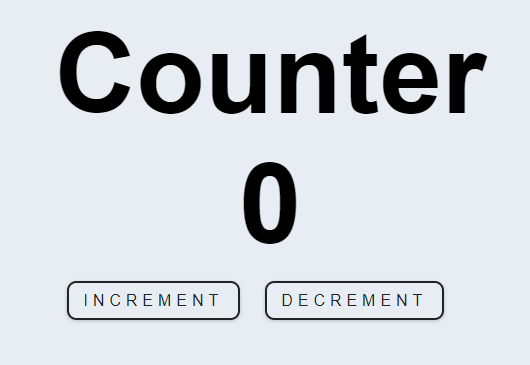

### Jeddy
We make it fun and enjoyable to create Web UIs using pure javascript(No HTML Tags).
It is now easy to write clean, reusable and maintainable code with Jeddy.

### Quick start
```sh
# Clone the Quick Start repository
$ git clone https://github.com/Jeraldy/jeddy-redux-quick-start

# Go into the repository
$ cd jeddy-redux-quick-start

# Install the dependencies and run
$ npm install && npm start
```
Then open: [http://localhost:9000/](http://localhost:9000/)

### How does Jeddy work?
Jeddy creates a virtual DOM in memory, which is a representation of the document object model. Instead of manipulating the browser's DOM directly, all the changes are applied to the virtual DOM first, and then, using a diffing algorithm, the minimal scope of necessary DOM operations is calculated. Finally, the real DOM tree is updated accordingly by applying changes only to what needs to be changed, ensuring minimum time consumed. This method guarantees a better user experience and higher app performance.

### Getting started
We will build a simple counter application using two approaches. The first part will use a simple stateful widget, and then we will enhnace it by using [redux](https://redux.js.org/). The second approach is recommended for better state management and performance.
    <!-- <p align="center">
        
    </p> -->
#### PART I: The simple way(Using a StatefulWidget)
 - You can find a finished version of the sample code for this part [HERE](https://github.com/Jeraldy/jeddy-quick-start).
 - The demo for this can be found [HERE](https://jeddy-counter.netlify.app/).

#### Step 1: Clone the quick start repository
```sh
$ git clone https://github.com/Jeraldy/jeddy-quick-start
$ cd jeddy-quick-start
$ npm install && npm start
```
Then open: [http://localhost:9000/](http://localhost:9000/)

#### Step 2: Folder structure

    ├── node_modules
    ├── public
    │   └── index.html
    ├── src
    │   ├── index.css
    │   └── index.js
    ├── .gitignore
    ├── package.json
    ├── package-lock.json
    ├── README.md
    ├── tsconfig.json
    └── webpack.config.js
**public/index.html**: 
When running, the app will render its content into the `div#root`, therefore this div
should not be removed. The script tag with `app.bundle.js` is needed to load our compiled js files. This is a regular *html* file so feel free to add global css, icons etc..<br>
**src/index.js**:
This is the main entry of our app, and the `Jeddy.Init` connects the app logic to the dom.
The *Main* class has a mutable state since it extends a `StatefulWidget`, 
this gives our app the power to act on user interactivity, and therefore updating the corresponding parts of the UI bindend to the state mutated. All we have to do is to ensure the state is notified for changes by using `this.setState`.
```js
import { Jeddy, StatefulWidget } from "jeddy";
import Div from "jeddy/dom/Div";

class Main extends StatefulWidget {
    constructor() {
        super()
        return this.connect()
    }
    render() {
        return Div({
            children: ["Hello World"]
        })
    }
}

Jeddy.Init({ app: new Main() });
```

#### Step 3: Lets add some logic (src/index.js)
Lets add a counter variable, and two functions to Increment and Decrement it.
```js
import { Jeddy, StatefulWidget } from "jeddy";
import Div from "jeddy/dom/Div";

class Main extends StatefulWidget {
     constructor() {
        super()
        this.state = {
            counter: 0
        }
        return this.connect()
    }

    handleIncrement() {
        this.setState({
            counter: this.state.counter + 1
        })
    }

    handleDecrement() {
        this.setState({
            counter: this.state.counter - 1
        })
    }

    render() {
        return Div({
            children: [
              "Hello World"
            ]
        })
    }
}

Jeddy.Init({ app: new Main() });
```

#### Step 4: Updating our UI (src/index.js).
  Lets add two buttons to `Increment` and `Decrement` the counter respectively.
```js
import { Jeddy, StatefulWidget } from "jeddy";
import Div from "jeddy/dom/Div";
import Center from "jeddy/layouts/Center";
import Button from "jeddy/dom/Button";

class Main extends StatefulWidget {
    constructor() {
        super()
        this.state = { counter: 0 }
        return this.connect()
    }

    handleIncrement() {
        this.setState({ counter: this.state.counter + 1 })
    }

    handleDecrement() {
        this.setState({ counter: this.state.counter - 1 })
    }

    render() {
        return Center({
            child: Div({
                children: [
                    `Counter: ${this.state.counter}`,
                    Button({
                        children: ["Increment"],
                        onClick: () => this.handleIncrement()
                    }),
                    Button({
                        children: ["Decrement"],
                        onClick: () => this.handleDecrement()
                    }),
                ]
            })
        })
    }
}

Jeddy.Init({ app: new Main() });
 ```

#### Step 5: Let's make it pretty
 We have imported `index.css` which contans some css to style our buttons.
 You can also add inline styles like the way we have styled the div which displays
 the counts.
```js
import { Jeddy, StatefulWidget } from "jeddy";
import Div from "jeddy/dom/Div";
import Center from "jeddy/layouts/Center";
import Button from "jeddy/dom/Button";
import Br from "jeddy/dom/Br";
import './index.css';

class Main extends StatefulWidget {
    constructor() {
        super()
        this.state = { counter: 0 }
        return this.connect()
    }

    handleIncrement() {
        this.setState({ counter: this.state.counter + 1 })
    }

    handleDecrement() {
        this.setState({ counter: this.state.counter - 1 })
    }

    render() {
        return Center({
            child: Div({
                children: [
                    Div({
                        children: ['Counter', Br(), `${this.state.counter}`],
                        style: {
                            textAlign: 'center',
                            fontSize: '6rem',
                            fontWeight: 'bold'
                        }
                    }),
                    Div({
                        children: [
                            Button({
                                class: 'btn',
                                children: ["Increment"],
                                onClick: () => this.handleIncrement()
                            }),
                            Button({
                                class: 'btn',
                                children: ["Decrement"],
                                onClick: () => this.handleDecrement()
                            }),
                        ]
                    })
                ]
            })
        })
    }
}

Jeddy.Init({ app: new Main() });
```

#### PART II: The redux way
 - You can find a finished version of the sample code for this part [HERE](https://github.com/Jeraldy/jeddy-redux-quick-start) and the demo  [HERE](https://jeddy-counter.netlify.app/)
 - Redux is, at its core, an incredibly simple pattern. It saves a current value, runs a single function to update that value when needed, and notifies any subscribers that something has changed.
 - Since the framework *for now* supports only a single instance of a StatefulWidget (The Main),
 therefore keeping all your state in the top-level widget. This can sometimes get messy if you have a reasonable amounts of data changing over time. [Redux](https://redux.js.org/) provides an easy way to manage state by providing a single source of truth for your state.

#### Step 1: Adding files and folders
  - Lets create some folders and files that will help us keep our app neat.
  - Our new app tree should look like this.
```sh
    ├── node_modules
    ├── public
    │   └── index.html
    ├── src
    │   ├── Reducers
    │   │   ├── Counter.js
    │   │   └── index.js
    │   ├── Widgets
    │   │   ├── Increment.js
    │   │   └── Decrement.js   
    │   ├── App.css
    │   ├── App.js
    │   └── index.js
    ├── .gitignore
    ├── package.json
    ├── package-lock.json
    ├── README.md
    ├── tsconfig.json
    └── webpack.config.js
```

#### Step 2: Creating Reducers
- [Reducers](https://redux.js.org/basics/reducers) simply contains the actions/functions that mutates the state.
- We will be dispatching/calling those actions from our widgets to increment/decrement the counter.
- Lets take a look into the `src/Reducers/Counter.js`
```js
import { createReducer } from "jeddy/jredux";

const counterReducer = createReducer({
    name: 'counter',
    initialState: { counter: 0 },
    reducers: {
        handleIncrement: (state) => {
            return { counter: state.counter + 1 }
        },
        handleDecrement: (state) => {
            return { counter: state.counter - 1 }
        }
    }
})

export const { reducer, actions } = counterReducer;
```
This should look familiar. We have initialized our counter to zero as previously.
We have defined our functions to `Increment` and `Decrement` the counter respectively.
Now lets take a look into the `Reducers/index.js`.This is the main entry of our reducers, so all reducers should be registered here.
```js
import { reducer as counterReducer } from './Counter'

export default { counterReducer }
```

#### Step 3: Refactoring our widgets:
- We have refactored our code to separate the `Increment` and `Decrement` buttons.
- Separating these two button might seem trivial  for a relatively simple app like this.
But this is a common pattern for real apps which normally have lots of widgets and complex logic.
```sh
    ├── Widgets
        ├── Increment.js
        └── Decrement.js
```
*src/Widgets/Increment.js*
```js
import { actions } from '../Reducers/Counter';
import Button from 'jeddy/dom/Button';
import { dispatch } from 'jeddy/jredux';
const { handleIncrement } = actions

const Increment = () => {
    return Button({
        class: 'btn',
        children: ['Increment'],
        onclick: () => dispatch(handleIncrement())
    })
}

export default Increment;
```
This should also look familiar, We have our button which on click calls the `handleIncrement`
defined into the counter reducer. This is the same for `Decrement` button as well.
*src/Widgets/Decrement.js*
```js
import { actions } from '../Reducers/Counter';
import Button from 'jeddy/dom/Button';
import { dispatch } from 'jeddy/jredux';
const { handleDecrement } = actions

const Decrement = () => {
    return Button({
        class: 'btn',
        children: ['Decrement'],
        onclick: () => dispatch(handleDecrement())
    })
}

export default Decrement;
```
*src/App.js*:
 - This just combines the Increment and Decrement widgets to create a single widget.
 - You can notice that we have a connect function at the bottom, this gives us a way to access the state
 and pull out the counterReducer.
 - The ES6 spread operator(...) unpacks the state into its individual props.
 - Therefore the counter variable becomes available to our widget like this `({ counter })`.

```js
import Div from "jeddy/dom/Div";
import Center from "jeddy/layouts/Center";
import Row from "jeddy/layouts/Row";
import Br from "jeddy/dom/Br";
import RowAlignment from "jeddy/layouts/RowAlignment";
import Increment from "./Widgets/Increment";
import Decrement from "./Widgets/Decrement";
import { connect } from "jeddy/jredux";
import './App.css';

const App = ({ counter }) => {
    return Center({
        child: Div({
            children: [
                Div({
                    children: ['Counter', Br(), `${counter}`],
                    style: {
                        textAlign: 'center',
                        fontSize: '6rem',
                        fontWeight: 'bold'
                    }
                }),
                Row({
                    children: [Increment(), Decrement()],
                    align: RowAlignment.SpaceBetween
                })
            ]
        })
    })
}

const mapStateToProps = (state) => {
    return { ...state.counterReducer }
}

export default connect(mapStateToProps)(App)
```
#### Step 4: Connecting reducers to the widget tree
- At this point every thing is all setup, but our widgets constellation doesn't recognise the presence of reducers.
- Now lets do that in the *src/index.js*
- We import the root reducer from *'./Reducers/index'* and then passing it 
  to our main widget so that it becomes available down the tree.
- We are calling the *updateState* inside the `connectedCallBack` to subscribe for the subsequent updates and activate the initial state.
- The `connectedCallBack` is a life cycle method which gets invoked when our main widget gets connected to the dom tree.
*src/index.js*
```js
import { Jeddy, StatefulWidget } from "jeddy";
import reducers from './Reducers/index';
import { updateState } from "jeddy/jredux";
import App from "./App";

class Main extends StatefulWidget {
    constructor(props) {
        super(props)
        return this.connect()
    }
    connectedCallBack() { updateState(this) }
    render() { return App() }
}

Jeddy.Init({ app: new Main({ reducers }) });
```

### Bulding for deployment
```sh
  $ npm run build
```
 After running the above command you will find the build folder
 in your workspace which contains site contents ready for hosting.
 Please read [Webpack guide](https://webpack.js.org/guides/production/)
 for further optimization tips.

**Thats it...!!! Can't wait to see what you build with jeddy. Keep Learning..👨‍💻**

### More Examples
- TodoList [[Demo](https://jeddy-todo-list.netlify.app/)] [[Code](https://github.com/Jeraldy/jeddy-example-projects)]
- Form Items [[Demo](https://jeddy-form-items.netlify.app/)] [[Code](https://github.com/Jeraldy/jeddy-example-projects)]
- Simple Table(With data fetch from API end point) [[Demo](https://jeddy-simple-table.netlify.app/)] [[Code](https://github.com/Jeraldy/jeddy-example-projects)]
> To list your cool project here open a PR or send the links to [jeraldydeus@gmail.com](jeraldydeus@gmail.com)

### Browser Support
 |  |  |  | 
| --- | --- | --- | --- | --- |
Latest ✔ | Latest ✔ | Latest ✔ | 9.1+ ✔ | Latest ✔ |

### Documentation
You can find the JeddyJs documentation [here](https://jeddyjs.netlify.app/).  
Check out the [Getting Started](https://jeddyjs.netlify.app/) page for a quick overview.
You can improve it by sending pull requests to [this repository](https://github.com/Jeraldy/JeddyJs).

### Contributors ✨
Thanks goes to these wonderful people:
<!-- ALL-CONTRIBUTORS-LIST:START - Do not remove or modify this section -->
<!-- prettier-ignore -->
<table>
  <tr>
     <td align="center"><a href="https://jeraldy.github.io/">
     <br /><sub><b>Jeraldy Deus</b></sub></a><br />
     <a href="https://github.com/Jeraldy/JeddyJs/commits?author=Jeraldy" title="Code">💻</a></td>
  </tr>
</table>

<!-- ALL+-CONTRIBUTORS-LIST:END -->
### Contributing
We love your input!
[Please read the guideline.](https://github.com/Jeraldy/JeddyJs/blob/master/CONTRIBUTING.md)

### License
The Jeddy JS is released under the
[MIT license](https://opensource.org/licenses/MIT).